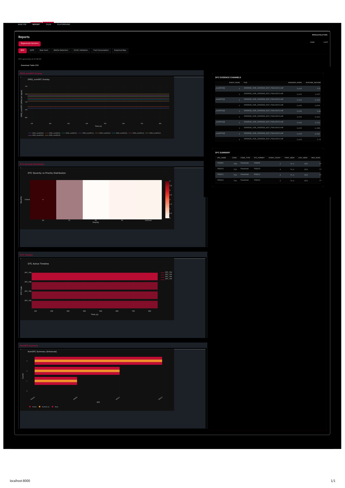
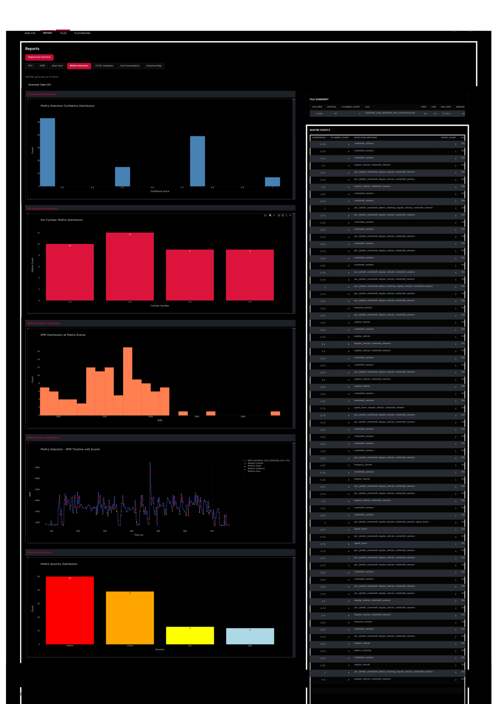
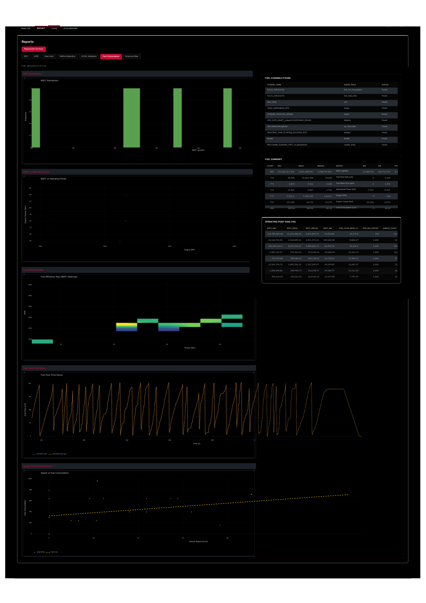
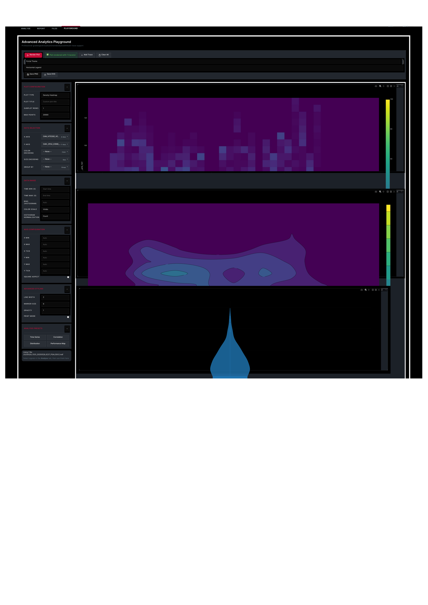

# 🚗 VEHICLE-LAB

<div align="center">


**A comprehensive vehicle diagnostic and analysis platform for MDF/MF4 files**

[🚀 Live Demo](#-live-demo) • [📖 Documentation](#-documentation) • [💻 Features](#-key-features) • [🔄 Workflow](#-workflow) • [📚 Repository Info](#-repository-contents)

> ⚠️ **Note:** This is a **documentation-only repository**. All source code (`.py` files) is **private and proprietary**. Only documentation, guides, and examples are included. See [CODE_PRIVACY.md](CODE_PRIVACY.md) for details.

</div>

---

## 📖 Overview

**VEHICLE-LAB** is a professional-grade web-based diagnostic tool designed for automotive engineers, calibration specialists, and fleet managers. It provides MATLAB-level accuracy in empirical map generation, advanced misfire detection, gear hunting analysis, and comprehensive fuel consumption monitoring.

### 🎯 What Makes It Special?

- **🔬 OEM-Level Analysis**: 9 misfire detection algorithms, advanced gear hunting detection
- **📊 MATLAB-Grade Maps**: Empirical map generation with Kriging, RBF, and cubic spline interpolation
- **🌐 Web-Based Dashboard**: No installation required, runs in any modern browser
- **📁 Multi-Format Support**: MDF, MF4, CSV, Excel (.xlsx, .xls)
- **🚀 Real-Time Processing**: Interactive Plotly visualizations with LTTB downsampling
- **🔍 Auto Signal Mapping**: Intelligent signal detection across 330+ DBC files from multiple OEMs

---

## 🚀 Live Demo

> **🌐 Try it online:** [Coming Soon - Deploy to Render/Railway/Heroku](#deployment)

### 📸 Dashboard Preview

<div align="center">

#### **Core Dashboard Features**

| **Main Interface** | **Signal Analysis** | **Empirical Maps** |
|:---:|:---:|:---:|
|  |  |  |
| Complete web-based interface | Interactive Plotly visualizations | 2D Heatmaps & 3D Surfaces |

| **Advanced Analytics** | **Misfire Detection** | **Fuel Efficiency** |
|:---:|:---:|:---:|
|  |  |  |
| Multi-signal correlation | 9 detection algorithms | BSFC & efficiency metrics |

</div>

> 💡 **Tip:** Click on any screenshot to view full-size images in the repository.

---

## ✨ Key Features

### 🎯 Core Analysis Modules

#### 1. **Empirical Map Generation** (MATLAB-Level)
- **7 Preset Templates**: CI/SI engine configurations
- **Advanced Interpolation**: Kriging (Gaussian Process), RBF, Cubic Spline
- **Uncertainty Quantification**: 95% confidence intervals
- **Map Types**: BSFC, Thermal Efficiency, BMEP, Volumetric Efficiency, Emission Maps
- **Quality Metrics**: R², RMSE, MAE, MAPE validation
- **Export Formats**: JSON, CSV, Excel, MATLAB (.mat)

#### 2. **Advanced Misfire Detection** (9 Algorithms)
- Crankshaft Variance Analysis
- FFT Frequency Domain Detection
- Statistical Anomaly Detection
- Angular Velocity Analysis
- Wavelet Transform
- ML-Based Classification
- OEM-Level Accuracy

#### 3. **Gear Hunting Analysis**
- Multi-signal correlation (Speed, RPM, Misfire)
- Automatic event detection
- Visualization with time-series plots
- Frequency analysis

#### 4. **Fuel Consumption Analysis**
- BSFC (Brake Specific Fuel Consumption) calculations
- Operating point mapping
- Efficiency analysis
- Real-world fuel economy metrics

#### 5. **Robust Advanced DFC (Dynamic Fuel Consumption) Analysis**
- **DTC Code Format Parsing**: Automatic OBD-II standard recognition (SAE J2012, J1979, ISO 14229)
  - P-codes (Powertrain), B-codes (Body), C-codes (Chassis), U-codes (Network)
  - Priority levels: P0 (SAE standard), P1 (Manufacturer-specific)
- **Status Byte Decoding**: ISO 14229 standard decoding
  - Test failed, Confirmed DTC, Pending DTC, MIL request status
- **Intelligent Severity Assessment**: 4-level classification (Critical/High/Medium/Low)
  - Scoring based on priority, frequency, duration, and code type
- **Temporal Analysis**: Exact time segments when DTCs are active
  - First/last occurrence tracking, maximum duration analysis
- **Signal Correlation**: Captures related signal values at DTC events
- **Freeze Frame Detection**: OBD-II freeze frame data extraction
- **Enhanced Visualizations**: Severity-color-coded plots with event timelines

#### 6. **IUPR (In-Use Performance Ratio) Monitoring**
- **OBD-II Compliance**: Real-world emission monitoring per SAE J1979
- **Monitor Completeness Tracking**: Tracks readiness status of all emission monitors
- **Compliance Ratio Calculation**: IUPR values for individual monitors and overall fleet
- **Driving Cycle Analysis**: Evaluates monitor completion across different drive cycles
- **Regulatory Reporting**: Generates compliance reports for regulatory requirements
- **Trend Analysis**: Historical IUPR tracking and degradation detection

#### 7. **Fleet Data Diagnosis & Analytics**
- **Multi-Vehicle Processing**: Batch analysis of multiple vehicle data files
- **Fleet-Wide Trend Analysis**: Identify patterns across entire vehicle fleets
- **Comparative Diagnostics**: Compare performance metrics across vehicles
- **Anomaly Detection**: Automated identification of outliers and problematic vehicles
- **Aggregated Reporting**: Fleet-level summaries and statistics
- **Health Monitoring**: Track vehicle health status across time
- **Predictive Analytics**: Early warning system for potential failures
- **Custom Fleet Dashboards**: Fleet-specific visualization and monitoring

### 🔧 Technical Features

- **Signal Mapping**: 330+ DBC files from multiple sources (comma.ai, OpenDBC, etc.)
- **Smart Signal Resolution**: Fuzzy matching with alias support
- **Chunked Processing**: Handles large MDF files efficiently
- **Interactive Visualizations**: Plotly with dark theme, auto-zoom
- **Real-Time Updates**: Progress tracking, async processing
- **RESTful API**: Comprehensive API for programmatic access

---

## 🔄 Workflow

### 📊 Complete Analysis Workflow

```
┌─────────────────────────────────────────────────────────────┐
│                    VEHICLE-LAB Workflow                      │
└─────────────────────────────────────────────────────────────┘

1. FILE UPLOAD
   ┌─────────────┐
   │ MDF/MF4/CSV │ ──► Drag & Drop ──► Server Processing
   └─────────────┘                      │
                                        ▼
2. CHANNEL DISCOVERY
   ┌──────────────────────────┐
   │ Auto Signal Detection     │
   │ - Signal name mapping     │
   │ - DBC file matching       │
   │ - Alias resolution        │
   └──────────────────────────┘
                  │
                  ▼
3. SIGNAL SELECTION
   ┌──────────────────────────┐
   │ User Selects Signals     │
   │ - Time range selection   │
   │ - Downsampling options   │
   └──────────────────────────┘
                  │
                  ▼
4. ANALYSIS SELECTION
   ┌─────────────────────────────────────┐
   │ Choose Analysis Module:              │
   │ ├─ Empirical Map Generation          │
   │ ├─ Misfire Detection                 │
   │ ├─ Gear Hunt Analysis                │
   │ ├─ Fuel Consumption                  │
   │ ├─ DFC Analysis                      │
   │ └─ IUPR / CC/SL                      │
   └─────────────────────────────────────┘
                  │
                  ▼
5. PROCESSING & VISUALIZATION
   ┌──────────────────────────┐
   │ Real-Time Processing     │
   │ - Steady-state detection │
   │ - Outlier removal        │
   │ - Interpolation          │
   │ - Statistical analysis   │
   └──────────────────────────┘
                  │
                  ▼
6. RESULTS & EXPORT
   ┌──────────────────────────┐
   │ Interactive Plots        │
   │ - 2D Heatmaps            │
   │ - 3D Surface Plots       │
   │ - Time-series            │
   │ Export: CSV/Excel/JSON   │
   └──────────────────────────┘
```

### 🎬 Step-by-Step User Workflow

#### **Step 1: Upload Data File**
```bash
1. Launch dashboard: python3 launch_dashboard.py
2. Open browser: http://localhost:8000
3. Drag & drop MDF/MF4 file into upload area
4. Wait for file processing confirmation
```

#### **Step 2: Discover Available Signals**
```bash
1. Click "Files" tab
2. Select uploaded file
3. View list of available channels/signals
4. System auto-maps signal names using DBC database
```

#### **Step 3: Select Signals for Analysis**
```bash
1. Navigate to "Analyse" tab
2. Select desired signals (e.g., Engine RPM, Vehicle Speed)
3. Choose time range (optional)
4. Select downsampling method (LTTB/Stride)
```

#### **Step 4: Choose Analysis Module**

**For Empirical Maps:**
```bash
1. Select "Empirical Map" section
2. Choose map template (BSFC, Thermal Efficiency, etc.)
3. Select X-axis signal (e.g., Engine RPM)
4. Select Y-axis signal (e.g., Engine Load)
5. Configure interpolation method (Kriging/RBF/Cubic Spline)
6. Click "Generate Map"
```

**For Misfire Detection:**
```bash
1. Select "Misfire Detection" section
2. Upload MDF file with crankshaft/camshaft data
3. System runs 9 detection algorithms
4. View misfire events with timestamps
5. Analyze frequency and severity plots
```

**For Gear Hunting:**
```bash
1. Select "Gear Hunt" section
2. System analyzes Speed, RPM correlation
3. Detects hunting events automatically
4. Visualizes events with multi-signal plots
```

#### **Step 5: View Results & Export**
```bash
1. Interactive plots appear automatically
2. Use Plotly controls (zoom, pan, hover)
3. Click "Export" for CSV/Excel download
4. Generate PDF reports (coming soon)
```

---

## ⚙️ Installation

### Prerequisites

- **Python 3.8+** (Python 3.10+ recommended)
- **pip** (Python package manager)
- **Modern web browser** (Chrome, Firefox, Edge, Safari)

### Using Analysis Modules

The analysis modules in this repository can be used independently:

```bash
# 1. Clone the repository
git clone https://github.com/25Bonged/VEHICLE-LAB.git
cd VEHICLE-LAB/backend_mdf

# 2. Install dependencies
pip install -r requirements.txt

# 3. Import and use analysis modules
python3 -c "from custom_map import generate_empirical_map"
python3 -c "from custom_misfire import detect_misfires"
python3 -c "from custom_gear import analyze_gear_hunt"
# etc.
```

> ⚠️ **Note:** The full dashboard application (`app.py`, `frontend.html`) is proprietary and not included in this repository. This repo contains documentation and reusable analysis modules.

### Detailed Installation

#### Step 1: Clone Repository
```bash
git clone https://github.com/25Bonged/VEHICLE-LAB.git
cd VEHICLE-LAB/backend_mdf
```

#### Step 2: Create Virtual Environment (Recommended)
```bash
# Create virtual environment
python3 -m venv venv

# Activate virtual environment
# On macOS/Linux:
source venv/bin/activate
# On Windows:
venv\Scripts\activate
```

#### Step 3: Install Dependencies
```bash
pip install --upgrade pip
pip install -r requirements.txt

# Additional dependencies (if needed):
pip install pandas numpy plotly asammdf scipy scikit-learn flask-cors
```

#### Step 4: Verify Installation
```bash
python3 -c "import flask, pandas, numpy, plotly, asammdf; print('✅ All dependencies installed!')"
```

#### Step 5: Launch Dashboard
```bash
python3 launch_dashboard.py
```

You should see:
```
🚀 Starting MDF Analytics Dashboard...
📁 Working directory: /path/to/backend_mdf
✅ App imported successfully
🌐 Starting server on http://localhost:8000
📊 Dashboard will be available at: http://localhost:8000
```

#### Step 6: Access Dashboard
Open your browser and navigate to: **http://localhost:8000**

---

## 📁 Project Structure

```
backend_mdf/
├── 📱 Core Application
│   ├── app.py                    # Flask backend server (main API)
│   ├── frontend.html             # Web dashboard interface
│   └── launch_dashboard.py       # Dashboard launcher script
│
├── 🔬 Analysis Modules
│   ├── custom_map.py             # Empirical map engine (Enhanced)
│   ├── custom_misfire.py         # Misfire detection (9 algorithms)
│   ├── custom_gear.py            # Gear hunt analysis
│   ├── custom_fuel.py            # Fuel consumption analysis
│   ├── custom_iupr.py            # IUPR analysis
│   ├── custom_dfc.py             # Dynamic fuel consumption
│   └── custom_cc_sl.py           # Catalyst/Secondary Air
│
├── 🛠️ Supporting Modules
│   ├── signal_mapping.py         # Signal name mapping utilities
│   ├── cie.py                    # CIE analysis integration
│   └── simple_map_fallback.py    # Fallback map generation
│
├── 📊 Data Files
│   ├── collected_dbc_files/      # 330+ DBC files (comma.ai, OpenDBC, etc.)
│   ├── uploads/                  # User-uploaded MDF files
│   └── test_data/                # Sample test data
│
└── 📚 Documentation
    ├── README.md                 # This file
    ├── DASHBOARD_USER_GUIDE.md   # Complete user guide
    ├── PROJECT_SUMMARY.md        # Project overview
    └── docs/                     # Additional documentation
        └── screenshots/          # Dashboard screenshots
```

---

## 🚀 Deployment

### Deploy to Render

1. **Create `render.yaml`:**
```yaml
services:
  - type: web
    name: vehicle-lab
    env: python
    buildCommand: pip install -r requirements.txt
    startCommand: python3 app.py
    envVars:
      - key: PORT
        value: 8000
```

2. **Deploy:**
   - Connect GitHub repository to Render
   - Render will auto-deploy on push

### Deploy to Railway

1. **Create `Procfile`:**
```
web: python3 app.py
```

2. **Deploy:**
   - Connect GitHub repository to Railway
   - Railway auto-detects Python and deploys

### Deploy to Heroku

1. **Create `Procfile`:**
```
web: python3 app.py
```

2. **Create `runtime.txt`:**
```
python-3.10.0
```

3. **Deploy:**
```bash
heroku create vehicle-lab
git push heroku main
```

### Update app.py for Production

Modify `app.py` to use environment variable for port:

```python
if __name__ == '__main__':
    port = int(os.environ.get('PORT', 8000))
    app.run(host='0.0.0.0', port=port, debug=False)
```

---

## 📚 Documentation

Comprehensive documentation is available:

- **[📖 Complete User Guide](DASHBOARD_USER_GUIDE.md)** - Full walkthrough for all features
- **[🔬 Empirical Map Guide](QUICK_START_EMPIRICAL_MAP.md)** - Map generation tutorial
- **[⚡ Misfire Detection](MISFIRE_SYSTEM_VERIFICATION.md)** - Misfire algorithms explained
- **[⛽ Fuel Analysis](FUEL_CONSUMPTION_ANALYSIS.md)** - Fuel consumption metrics
- **[🗺️ Signal Mapping](SIGNAL_MAPPING_DOCUMENTATION.md)** - DBC file integration
- **[📊 Project Summary](PROJECT_SUMMARY.md)** - Technical overview

---

## 🎬 Usage Examples

### Example 1: Generate BSFC Map

```python
# 1. Upload MDF file via web interface
# 2. Navigate to "Empirical Map" section
# 3. Select:
#    - Template: BSFC (Brake Specific Fuel Consumption)
#    - X-axis: Engine RPM
#    - Y-axis: Engine Load
#    - Interpolation: Kriging
# 4. Click "Generate Map"
# 5. View 2D heatmap and 3D surface plot
```

### Example 2: Detect Misfire Events

```python
# 1. Upload MDF file with crankshaft data
# 2. Navigate to "Misfire Detection" section
# 3. System automatically:
#    - Runs 9 detection algorithms
#    - Identifies misfire events
#    - Generates severity plots
# 4. Review events with timestamps
```

### Example 3: Analyze Gear Hunting

```python
# 1. Upload MDF file with transmission data
# 2. Navigate to "Gear Hunt" section
# 3. System automatically:
#    - Correlates Speed and RPM signals
#    - Detects hunting events
#    - Visualizes with time-series plots
```

---

## 🛠️ API Reference

### Core Endpoints

#### Upload File
```http
POST /api/upload
Content-Type: multipart/form-data

Response: {
  "success": true,
  "filename": "example.mdf",
  "size": 1024000
}
```

#### Get Channels
```http
GET /api/files/{filename}/channels

Response: {
  "channels": ["EngineRPM", "VehicleSpeed", ...],
  "count": 150
}
```

#### Extract Signals
```http
POST /api/analytics
Content-Type: application/json

{
  "filename": "example.mdf",
  "ids": ["EngineRPM", "VehicleSpeed"],
  "tmin": 0,
  "tmax": 1000,
  "downsample": 1000,
  "algo": "lttb"
}
```

#### Generate Empirical Map
```http
POST /api/empirical_map
Content-Type: application/json

{
  "filename": "example.mdf",
  "template": "bsfc",
  "x_signal": "EngineRPM",
  "y_signal": "EngineLoad",
  "method": "kriging"
}
```

For complete API documentation, see [DASHBOARD_USER_GUIDE.md](DASHBOARD_USER_GUIDE.md#api-reference).

---

## 🧪 Testing

```bash
# Run all tests
python3 -m pytest test_*.py

# Test specific modules
python3 test_misfire_full.py
python3 test_map_comprehensive.py
python3 test_gear_plots.py
```

---

## 🤝 Contributing

We welcome contributions! Please follow these steps:

1. **Fork the repository**
2. **Create a feature branch**: `git checkout -b feature/amazing-feature`
3. **Commit your changes**: `git commit -m 'Add amazing feature'`
4. **Push to the branch**: `git push origin feature/amazing-feature`
5. **Open a Pull Request**

### Contribution Guidelines

- Follow PEP 8 style guide
- Add tests for new features
- Update documentation
- Ensure all tests pass

---

## 🏗️ Architecture

### System Architecture Diagram

```
┌─────────────────────────────────────────────────────────────┐
│                    Client (Web Browser)                      │
│  ┌────────────┐  ┌────────────┐  ┌────────────┐             │
│  │   HTML5    │  │ JavaScript │  │   Plotly  │             │
│  │   CSS3     │  │  (ES6+)    │  │ Charts    │             │
│  └────────────┘  └────────────┘  └────────────┘             │
└────────────────────────┬────────────────────────────────────┘
                         │ HTTP/REST API
┌────────────────────────▼────────────────────────────────────┐
│              Flask Backend Server (Python)                    │
│  ┌──────────────────────────────────────────────────────┐   │
│  │  Core Application (app.py)                          │   │
│  │  - File Upload & Processing                         │   │
│  │  - Signal Extraction & Caching                     │   │
│  │  - RESTful API Endpoints                            │   │
│  └──────────────────────────────────────────────────────┘   │
│  ┌──────────────────────────────────────────────────────┐   │
│  │  Analysis Modules                                    │   │
│  │  ├─ custom_map.py (Empirical Maps)                  │   │
│  │  ├─ custom_misfire.py (Misfire Detection)          │   │
│  │  ├─ custom_gear.py (Gear Hunt)                     │   │
│  │  ├─ custom_fuel.py (Fuel Analysis)                 │   │
│  │  └─ custom_iupr.py, custom_dfc.py, etc.              │   │
│  └──────────────────────────────────────────────────────┘   │
└────────────────────────┬────────────────────────────────────┘
                         │
┌────────────────────────▼────────────────────────────────────┐
│                    Data Processing Layer                     │
│  ┌────────────┐  ┌────────────┐  ┌────────────┐            │
│  │  asammdf   │  │  pandas    │  │  numpy     │            │
│  │ (MDF/MF4)  │  │ (DataFrames│  │ (Arrays)   │            │
│  └────────────┘  └────────────┘  └────────────┘            │
│  ┌────────────┐  ┌────────────┐  ┌────────────┐            │
│  │  scipy     │  │ scikit-learn│  │ signal_mapping│        │
│  │ (Interpolation)│ (ML)      │  │ (DBC files)│            │
│  └────────────┘  └────────────┘  └────────────┘            │
└─────────────────────────────────────────────────────────────┘
```

---

## 📄 License

This project is licensed under the MIT License - see the [LICENSE](LICENSE) file for details.

## 📋 Changelog

See [CHANGELOG.md](CHANGELOG.md) for a detailed list of changes and version history.

---

## 🙏 Acknowledgments

- **DBC Files**: Thanks to [comma.ai OpenDBC](https://github.com/commaai/opendbc), [cantools](https://github.com/cantools/cantools)
- **Libraries**: Flask, Plotly, asammdf, pandas, numpy, scipy
- **Inspiration**: MATLAB-based calibration tools

---

## 📞 Contact & Support

- **GitHub Issues**: [Report bugs or request features](https://github.com/25Bonged/VEHICLE-LAB/issues)
- **Repository**: [https://github.com/25Bonged/VEHICLE-LAB](https://github.com/25Bonged/VEHICLE-LAB)

---

<div align="center">

**Made with ❤️ for the automotive engineering community**

⭐ **Star this repo if you find it useful!**

</div>
